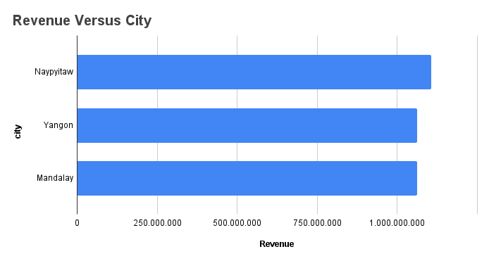
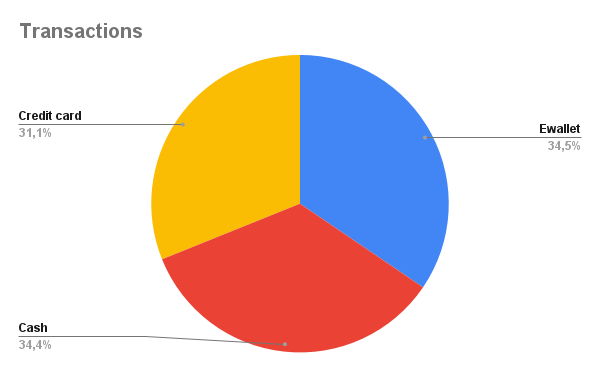

# 🇺🇸 Supermarket Sales Analysis

## 📊 Project Overview

This project analyzes supermarket sales data using SQL in PostgreSQL.

The objective is to explore the dataset and extract business insights such as 
- revenue performance
- customer behavior
- product trends

## ❓ Business Questions

1. Total revenue?
2. Revenue by city?
3. Revenue by product line?
4. Quantity of products sold?
5. Most used payment method?
6. Average order value?
7. Average order value by city?
8. Revenue by gender?
9. City ranking? (Window Function)
10. Bestselling products?
    
# 🛒 Supermarket Sales Analysis (SQL Project)

🇺🇸 English below | 🇧🇷 Português abaixo

---

# 🇧🇷 Análise de Vendas de Supermercado

## 📊 Visão do Projeto

Este projeto analisa dados de vendas de um supermercado utilizando SQL no PostgreSQL.

O objetivo é explorar o dataset e extrair insights de negócio como:

- desempenho de vendas
- comportamento dos clientes
- categorias de produtos mais vendidas

## ❓ Perguntas de Negócio

1. Receita total?
2. Receita por cidade?
3. Receita por linha de produto?
4. Quantidade de produtos vendidos?
5. Mêtodo de pagamento mais utilizado?
6. Ticket médio?
7. Ticket médio por cidade?
8. Receita por gênero?
9. Ranking de cidades? (Window Function)
10. Produtos mais vendidos?

---

## 📊 Data Visualization

### Revenue vs City

**Português:** Receita total por cidade.

---

### Revenue vs Product Line

**Português:** Receita por linha de produto.

---

### Transactions Distribution

**Português:** Distribuição das transações registradas no dataset.
